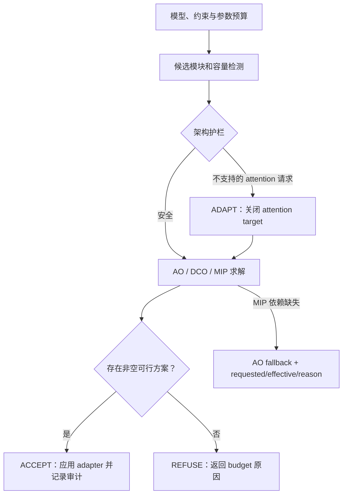

# C3｜工业缺陷检测：V-PEFT 小样本实战

> C3 研究总览与证据入口（更新至 2026-09-01） 
> 核心矩阵：`765c559`｜补全研究：`bf6c7c5`｜数据增强：`c9ac36a`

## 1. 研究问题与结论

本课题研究：**V-PEFT 能否在 NEU-DET 与 DeepPCB 小样本检测中，用更少的可训练参数逼近 Full-SFT，并通过 Planner、LOVO 与约束求解形成可审计的自动配置闭环？**

当前证据支持以下结论：

1. **V-PEFT 明显减少可训练参数，但不是普遍更准确、更快或更省峰值显存。** 原 accuracy-first V-PEFT 使用 613,602 个可训练参数，比 Full-SFT 减少 76.32%；其精度保持率随数据集和样本数明显变化。
2. **把可训练参数进一步压到 Full-SFT 的 10% 以下会产生明显精度代价。** 新设置使用 195,410 个参数（Full-SFT 的 7.54%），但 8 个单元的平均 mAP50-95 从 0.35181 降至 0.27750。因此这是 parameter–accuracy trade-off，不是精度改进。
3. **Planner 闭环已经补齐。** 两个数据集均完成 AO、DCO 与 native MIP；MIP 为 OR-Tools SCIP 实际求解，不是 fallback。`ACCEPT / ADAPT / REFUSE` 三个分支均有真实输入、结构化日志和回归测试。
4. **LOVO 已从 cold-start prior 升级为 learned calibration，但可信度仍很低。** 使用 6 个独立 calibration 单元和 2 个 held-out 单元，confidence 为 0.01667；该结果只能视为有限证据，不能宣传为可靠精度预测器。
5. **数据增强的效果具有数据集依赖性。** DeepPCB 的 medium augmentation 在 10/50/100/500-shot 均取得显著 paired 提升；NEU-DET mild 未超过历史 accuracy-first baseline，不能称为改善。

因此，本项目已经完成任务书范围内的主要实验、机制补全、受控消融与证据审计；但这不等于导师或主办方已经完成正式验收。最终报告、展示材料和外部验收仍应基于下述限制如实表述。

## 2. 完成状态

| 模块 | 已完成证据 | 状态 |
| --- | --- | --- |
| P0：两数据集 V-PEFT 闭环 | NEU-DET / DeepPCB strict Planner、实际 PEFT、adapter 与 checkpoint 审计 | 完成 |
| P0：solver | 两数据集 AO / DCO / native MIP；requested/effective/fallback 均记录 | 完成 |
| P0：Planner 分支 | `ACCEPT / ADAPT / REFUSE` 三分支真实复现 | 完成 |
| LOVO | 6 calibration + 2 held-out learned regression；误差、区间与低 confidence 报告 | 完成（低置信度限制） |
| P1：三方对照 | Full-SFT / Frozen Backbone / V-PEFT，2 数据集 × 3 seed | 完成 |
| P1：≤10% 参数目标 | 195,410 trainable，Full-SFT 的 7.54%；24 个 V-PEFT 单元重跑 | 完成（负结果） |
| P2：小样本缩放 | 10/50/100/500-shot 三策略矩阵，72/72 核心单元通过 | 完成 |
| 数据增强消融 | validation-only 搜索、选择冻结、locked test、34/34 训练 run | 完成 |
| DeepPCB 增强缩放 | 10/50/100/500-shot，3 seed paired 统计 | 完成 |
| GitHub 进度同步 | Issue #2 已同步补全与 augmentation 结论 | 完成 |

## 3. 统一实验边界

- 数据集：NEU-DET、DeepPCB；
- 模型与训练：YOLO11n、100 epochs、batch 8、imgsz 640、AdamW、AMP false；
- seed：824 / 825 / 826；
- 小样本划分：`10 ⊂ 50 ⊂ 100 ⊂ 500`，validation/test 固定；
- 设置选择只读取 validation；选择冻结后才运行 locked test；
- 主指标：mAP50-95；同时报告 mAP50、trainable parameters、peak GPU memory 与 GPU-hours；
- 统计：3-seed 均值、t 95% CI 和同 seed paired delta。由于只有 3 个 seed，结论不外推为普遍规律。

## 4. 核心 72-run 结果

下表是原 accuracy-first V-PEFT 的三 seed mAP50-95 均值。`Retention = V-PEFT / Full-SFT`。

| 数据集 | shots | Full-SFT | Frozen Backbone | V-PEFT | Retention |
| --- | ---: | ---: | ---: | ---: | ---: |
| NEU-DET | 10 | 0.1212 | 0.1325 | 0.1192 | 98.33% |
| NEU-DET | 50 | 0.2687 | 0.2195 | 0.2505 | 93.26% |
| NEU-DET | 100 | 0.3329 | 0.2935 | 0.3203 | 96.20% |
| NEU-DET | 500 | 0.3995 | 0.3769 | 0.3909 | 97.83% |
| DeepPCB | 10 | 0.2903 | 0.2206 | 0.1897 | 65.34% |
| DeepPCB | 50 | 0.5669 | 0.3898 | 0.3709 | 65.42% |
| DeepPCB | 100 | 0.6486 | 0.4844 | 0.5166 | 79.65% |
| DeepPCB | 500 | 0.7006 | 0.5979 | 0.6564 | 93.69% |

关键解释：

- NEU-DET 上 V-PEFT 与 Full-SFT 的差距较小；
- DeepPCB 低样本时差距明显，到 500-shot 才接近 Full-SFT；
- 原 V-PEFT 在 8 个条件中的 5 个高于 Frozen Backbone，但 8 个均值都没有超过 Full-SFT；
- 峰值显存仅比 Full-SFT 低约 1.2%，训练时间平均反而约增加 13%，因此不能声称当前实现更快或显著更省显存。

原始数据：[P2 summary](p2/results/p2_summary.csv)｜[paired analysis](p2/results/paired_analysis.csv)｜[最终验证](p2/evidence/p2_final_validation.json)

## 5. 参数效率补全：目标达成，但精度下降

| 设置 | 可训练参数 | 相对 Full-SFT | 8-cell 平均 mAP50-95 | 平均 peak MiB | 平均训练秒数 |
| --- | ---: | ---: | ---: | ---: | ---: |
| 原 accuracy-first V-PEFT | 613,602 | 23.68% | 0.35181 | 2,636.4 | 552.0 |
| 新 ≤10% V-PEFT | 195,410 | 7.54% | 0.27750 | 2,598.0 | 542.1 |

新设置实现了 92.46% 的 trainable parameter 减少，但准确率损失大于显存和时间收益。特别是 DeepPCB 10/50/100-shot 相对 Full-SFT 的 retention 仅为 38.0% / 36.2% / 57.3%。所以它证明了**可达到数量级参数效率**，同时也证明当前 recipe 下存在明显 accuracy cost。

完整结果：[completion report](completion/docs/C3_COMPLETION_REPORT.md)｜[old/new comparison](completion/results/old_new_vpeft.csv)｜[final summary](completion/results/final_summary.csv)

## 6. Planner、solver 与 LOVO

### 6.1 AO / DCO / native MIP

| 数据集 | solver | requested / effective | fallback | status | planned params |
| --- | --- | --- | --- | --- | ---: |
| NEU-DET | AO | ao / ao | false | ACCEPT | 191,616 |
| NEU-DET | DCO | dco / dco | false | ACCEPT | 1,352,576 |
| NEU-DET | MIP | mip / mip | false | OPTIMAL | 1,350,784 |
| DeepPCB | AO | ao / ao | false | ACCEPT | 191,616 |
| DeepPCB | DCO | dco / dco | false | ACCEPT | 1,352,576 |
| DeepPCB | MIP | mip / mip | false | OPTIMAL | 1,350,784 |

MIP 两行均由 `ortools==9.15.6755` 的 SCIP backend 原生求解。OR-Tools 缺失时的 AO fallback 仍由回归测试覆盖，但不与上述 native MIP 结果混写。

### 6.2 Planner 三分支

- ACCEPT：budget 2,100,000，选择 59 个模块；
- ADAPT：不支持的 attention 请求由 guardrail 调整后继续；
- REFUSE：budget 1 时无可行 adapter，明确拒绝而不伪造结果。

证据：[solver comparison](completion/evidence/solvers/solver_comparison.json)｜[Planner branches](completion/evidence/planner_branches/planner_branches.json)

### 6.3 LOVO learned calibration

| 项目 | 结果 |
| --- | ---: |
| calibration / held-out 单元 | 6 / 2 |
| predicted ΔmAP50-95 | -0.16002 |
| confidence | 0.01667 |
| CV RMSE / MAE / R² | 0.12842 / 0.11389 / -0.44000 |
| held-out RMSE / MAE | 0.10020 / 0.09888 |
| prediction interval | [-0.40821, 0.08816] |

它已经使用真实 learned evidence，不再把 cold-start prior 当测量值；但样本很少、design rank 为 1/12、区间很宽，因此只能作为 low-confidence calibration audit。

证据：[LOVO report](completion/evidence/lovo/lovo_calibration_report.json)

## 7. 数据增强消融

导师建议继续测试数据增强能否优化精度。实验先在 100-shot validation-only 搜索中选择 NEU-DET `mild` 与 DeepPCB `medium`，随后冻结设置再运行 locked test。

### 7.1 100-shot 结论

| 数据集 | 选择 | 新 no-aug | augmentation | paired Δ 与 95% CI | 对历史 baseline |
| --- | --- | ---: | ---: | --- | --- |
| NEU-DET | mild | 0.22739 | 0.30596 | +0.07857 `[-0.00463, 0.16177]` | -0.01433，CI 包含 0，**不是改善** |
| DeepPCB | medium | 0.53644 | 0.62621 | +0.08977 `[0.06140, 0.11814]` | +0.10960，**显著改善** |

### 7.2 DeepPCB scaling

| shots | no-aug | medium | paired Δ（95% CI） |
| ---: | ---: | ---: | --- |
| 10 | 0.20000 | 0.29082 | +0.09082 `[0.01594, 0.16569]` |
| 50 | 0.45055 | 0.54399 | +0.09344 `[0.07225, 0.11463]` |
| 100 | 0.53644 | 0.62621 | +0.08977 `[0.06140, 0.11814]` |
| 500 | 0.69124 | 0.73171 | +0.04047 `[0.01963, 0.06130]` |

四个 scale 的 paired CI lower 均高于 0，但 500-shot 的增益缩小，说明在**本次测试增强范围内**出现经验性饱和。它不是理论精度上限。500-shot 结果高于历史 Full-SFT 参考值，但 Full-SFT 没有用同一 augmentation 重训，不能据此宣传 V-PEFT 普遍优于 Full-SFT。

资源代价：trainable parameters 与测量 peak memory 不变；训练时间 NEU-DET 增加 56.6%，DeepPCB 增加 57.2%。

完整结果：[augmentation report](augmentation/docs/AUGMENTATION_ABLATION_REPORT.md)｜[paired statistics](augmentation/results/paired_test_statistics.csv)｜[scaling comparison](augmentation/results/scaling_comparison.csv)｜[frozen selection](augmentation/results/frozen_selection.json)

## 8. 验证与可复现性

- 核心 P0/P1/P2 与 integrated validators：PASS；
- 原核心矩阵：72/72；completion 新 V-PEFT：24/24；augmentation：34/34；
- augmentation 相关 pytest：426 passed / 17 skipped；
- checkpoint、seed、epoch、resolved config、SHA-256 manifest 均由 delivery validator 交叉检查；
- 搜索命令、leaf command、stdout/stderr、失败与重跑记录均保存在对应目录；
- 约 1.2 GiB 新 checkpoint 按仓库策略保留在服务器本地并 Git-ignore，Git 中保存 SHA-256 manifest 与验证记录。

复现入口：

- [P0 smoke 与 solver evidence](p0/README.md)
- [P1 100-shot 三策略对照](p1/README.md)
- [P2 multi-seed scaling](p2/README.md)
- [补全研究命令](completion/docs/EXECUTED_COMMANDS.md)
- [数据增强命令](augmentation/docs/EXECUTED_COMMANDS.md)
- [最终研究交付审计](final/README.md)

## 9. 已知限制

1. 每个条件只有 3 个 seed，部分 95% CI 较宽；
2. LOVO calibration 样本小且 rank-deficient，confidence 极低；
3. ≤10% 参数设置达成参数目标，但不是原 accuracy-first V-PEFT 的合理替代；
4. augmentation 提高了 DeepPCB 精度，同时增加约 57% 训练时间；
5. NEU-DET 未证明 augmentation 相对历史 baseline 的改进；
6. Full-SFT 没有在同一 augmentation protocol 下重训，禁止把 500-shot 参考比较解释成普遍方法优势；
7. adapter-only 文件尚未包含非 adapter predictor head，独立部署仍需要 full checkpoint；
8. 仓库存在与本课题无关的 legacy Ruff debt；C3 新增代码、critical gate 与 delivery validators 均已通过。

## 10. 对任务书的最终回答

V-PEFT 在本实验中实现了显著参数压缩，并在部分小样本条件下保留较高精度；Planner、solver、LOVO 与数据增强机制也已形成可审计证据链。但实验没有证明 V-PEFT 在所有数据集和规模上更准确、更快或显著更省显存。

最可靠的研究结论是：

> **V-PEFT 的价值是可控的参数–精度折中，而不是无条件优于 Full-SFT。数据增强可显著改善 DeepPCB，但该收益具有数据集依赖性并伴随训练时间成本。**

在线展示：[YOLO-V-PEFT](https://yoloc3vpeft.com/)（用于结果浏览和设备端演示；正式研究结论以仓库中的 CSV / JSON / 日志为准）。
