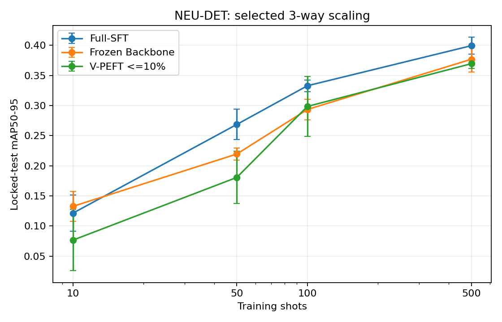
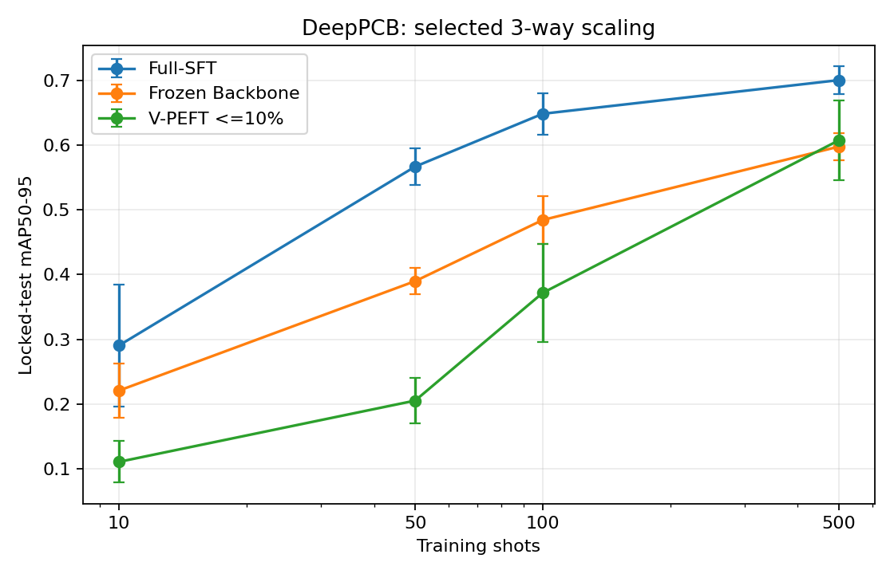
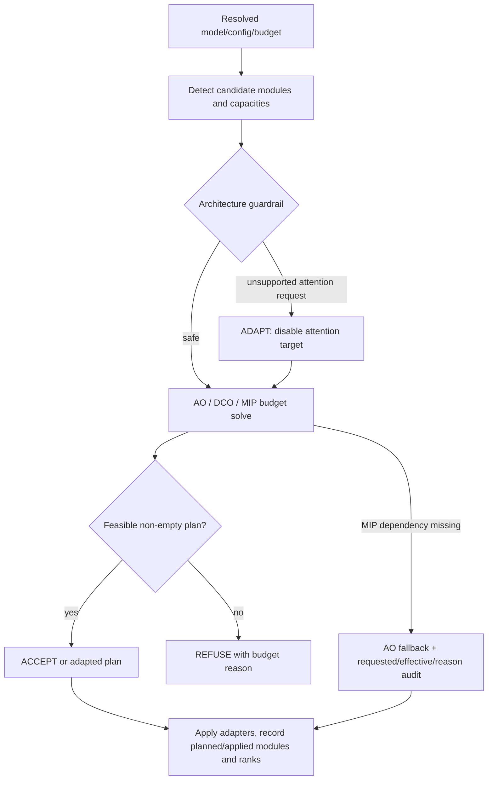

# C3 remaining-work completion report

## 결론

이 보고서는 기존 P0/P1/P2 원본과 2026-08-31에 새로 실행한 실험을 함께 감사한 결과다. 새 V-PEFT 설정은 trainable parameter 목표(Full-SFT의 10% 이하)를 충족했지만 정확도 유지에는 실패했다. 특히 DeepPCB 10/50/100-shot에서 Full-SFT 대비 retention이 38.0%/36.2%/57.3%였다. 따라서 이 결과를 V-PEFT 정확도 우위로 해석하지 않는다.

새 학습은 GPU 4에서 실행 중이던 다른 사용자의 프로세스를 건드리지 않고, preflight에서 비어 있던 GPU 0/1/2/3/5/6/7만 사용했다. validation-only search 8개와 선택 후 final matrix 24개는 모두 exit code 0, 100 finite epochs, checkpoint load, manifest hash, 실제 CUDA device 및 locked protocol check를 통과했다. 원본 scheduler 기록은 [search scheduler](../logs/search_scheduler.jsonl)와 [final scheduler](../logs/final_scheduler.jsonl)에 있다.

## 사전 고정 효율 탐색

[탐색 protocol](../config/efficiency_search_protocol.yaml)은 실행 전에 100-shot, seed 824, validation metric, 네 후보, tie rule을 고정했고 test 접근을 금지했다. 모든 시도는 [selection JSON](../results/efficiency_selection.json)과 [search CSV](../results/efficiency_search.csv)에 남아 있다.

| candidate | head policy | mean best val mAP50-95 | trainable | peak MiB | seconds | 선택 |
|---|---|---:|---:|---:|---:|---|
| b100k_predictors | predictors | 0.28085 | 104,530 | 2,570.2 | 406.9 | no |
| b150k_predictors | predictors | 0.27770 | 153,426 | 2,585.6 | 414.2 | no |
| b250k_predictors | predictors | 0.31014 | 195,410 | 2,595.8 | 413.1 | yes |
| b150k_frozen | frozen | 0.25819 | 139,776 | 2,585.6 | 400.6 | no |

선택된 `b250k_predictors`는 adapter 181,760개와 terminal box/class predictor 13,650개를 학습해 총 195,410개다. 이는 Full-SFT trainable 2,590,994개의 7.54%이며 92.46% 감소다. 기존 V-PEFT 613,602개보다도 68.15% 적다.

## 최종 3-way scaling 결과

모든 값은 seeds 824/825/826의 locked-test 결과다. `mean±sample SD [t 95% CI]`를 사용했다. Full/Frozen 48개는 raw metrics/checkpoint/manifest가 일치해 재사용했고, V-PEFT 24개는 새 설정으로 전부 다시 실행했다. 원본은 [72-run CSV](../results/final_all_runs.csv), [summary CSV](../results/final_summary.csv), [paired delta CSV](../results/paired_deltas.csv)다.

### NEU-DET

| shot | method | mAP50-95 mean±SD [95% CI] | mAP50 | retention | trainable / total | peak MiB | sec / GPU-h |
|---:|---|---|---:|---:|---:|---:|---:|
| 10 | Full-SFT | 0.1212±0.0122 [0.0911, 0.1514] | 0.3009 | 100.0% | 2,590,994 / 2,591,010 | 2682.9 | 192.5 / 0.0535 |
| 10 | Frozen Backbone | 0.1325±0.0101 [0.1075, 0.1576] | 0.3212 | 109.3% | 1,225,522 / 2,591,010 | 1607.7 | 176.4 / 0.0490 |
| 10 | V-PEFT ≤10% | 0.0764±0.0205 [0.0255, 0.1273] | 0.1778 | 63.0% | 195,410 / 2,772,770 | 2601.0 | 216.5 / 0.0601 |
| 50 | Full-SFT | 0.2687±0.0102 [0.2434, 0.2939] | 0.5580 | 100.0% | 2,590,994 / 2,591,010 | 2682.9 | 269.9 / 0.0750 |
| 50 | Frozen Backbone | 0.2195±0.0040 [0.2095, 0.2295] | 0.4767 | 81.7% | 1,225,522 / 2,591,010 | 1710.1 | 240.0 / 0.0667 |
| 50 | V-PEFT ≤10% | 0.1806±0.0175 [0.1371, 0.2242] | 0.3726 | 67.2% | 195,410 / 2,772,770 | 2601.0 | 290.4 / 0.0807 |
| 100 | Full-SFT | 0.3329±0.0039 [0.3233, 0.3425] | 0.6378 | 100.0% | 2,590,994 / 2,591,010 | 2652.2 | 356.2 / 0.0989 |
| 100 | Frozen Backbone | 0.2935±0.0069 [0.2764, 0.3106] | 0.5769 | 88.2% | 1,225,522 / 2,591,010 | 1699.8 | 325.1 / 0.0903 |
| 100 | V-PEFT ≤10% | 0.2986±0.0201 [0.2485, 0.3486] | 0.5699 | 89.7% | 195,410 / 2,772,770 | 2587.3 | 404.0 / 0.1122 |
| 500 | Full-SFT | 0.3995±0.0056 [0.3856, 0.4134] | 0.7165 | 100.0% | 2,590,994 / 2,591,010 | 2652.2 | 1173.8 / 0.3261 |
| 500 | Frozen Backbone | 0.3769±0.0084 [0.3561, 0.3977] | 0.6794 | 94.3% | 1,225,522 / 2,591,010 | 1699.8 | 1037.4 / 0.2882 |
| 500 | V-PEFT ≤10% | 0.3696±0.0031 [0.3620, 0.3772] | 0.6706 | 92.5% | 195,410 / 2,772,770 | 2587.3 | 1225.4 / 0.3404 |

### DeepPCB

| shot | method | mAP50-95 mean±SD [95% CI] | mAP50 | retention | trainable / total | peak MiB | sec / GPU-h |
|---:|---|---|---:|---:|---:|---:|---:|
| 10 | Full-SFT | 0.2903±0.0379 [0.1963, 0.3844] | 0.5020 | 100.0% | 2,590,994 / 2,591,010 | 2693.1 | 205.6 / 0.0571 |
| 10 | Frozen Backbone | 0.2206±0.0170 [0.1783, 0.2629] | 0.3862 | 76.0% | 1,225,522 / 2,591,010 | 1628.2 | 196.7 / 0.0546 |
| 10 | V-PEFT ≤10% | 0.1104±0.0130 [0.0782, 0.1426] | 0.2053 | 38.0% | 195,410 / 2,772,770 | 2621.4 | 231.4 / 0.0643 |
| 50 | Full-SFT | 0.5669±0.0113 [0.5389, 0.5949] | 0.8480 | 100.0% | 2,590,994 / 2,591,010 | 2689.7 | 277.1 / 0.0770 |
| 50 | Frozen Backbone | 0.3898±0.0082 [0.3693, 0.4103] | 0.6731 | 68.8% | 1,225,522 / 2,591,010 | 1720.3 | 258.4 / 0.0718 |
| 50 | V-PEFT ≤10% | 0.2051±0.0143 [0.1696, 0.2407] | 0.3410 | 36.2% | 195,410 / 2,772,770 | 2611.2 | 313.2 / 0.0870 |
| 100 | Full-SFT | 0.6486±0.0129 [0.6164, 0.6808] | 0.9226 | 100.0% | 2,590,994 / 2,591,010 | 2665.8 | 373.8 / 0.1038 |
| 100 | Frozen Backbone | 0.4844±0.0149 [0.4473, 0.5214] | 0.8060 | 74.7% | 1,225,522 / 2,591,010 | 1706.7 | 340.1 / 0.0945 |
| 100 | V-PEFT ≤10% | 0.3716±0.0306 [0.2957, 0.4476] | 0.5918 | 57.3% | 195,410 / 2,772,770 | 2594.1 | 414.1 / 0.1150 |
| 500 | Full-SFT | 0.7006±0.0085 [0.6796, 0.7217] | 0.9677 | 100.0% | 2,590,994 / 2,591,010 | 2652.2 | 1160.4 / 0.3223 |
| 500 | Frozen Backbone | 0.5979±0.0086 [0.5766, 0.6191] | 0.9257 | 85.3% | 1,225,522 / 2,591,010 | 1699.8 | 1061.9 / 0.2950 |
| 500 | V-PEFT ≤10% | 0.6076±0.0250 [0.5455, 0.6697] | 0.8918 | 86.7% | 195,410 / 2,772,770 | 2580.5 | 1242.3 / 0.3451 |

NEU-DET 100-shot과 DeepPCB 500-shot에서 새 V-PEFT mean이 Frozen보다 각각 0.0051, 0.0097 높지만 paired 95% CI가 모두 0을 포함한다. 다른 여섯 셀에서는 Frozen보다 낮다. Full-SFT보다 높은 셀은 없다. 이 결과는 정확도 우위가 아니라 parameter/accuracy trade-off다.

## 기존 V-PEFT와 새 설정

[old/new 원본 표](../results/old_new_vpeft.csv)에 따르면 8개 셀의 비가중 평균 mAP50-95는 0.35181에서 0.27750으로 감소했다. 평균 peak memory는 2,636.4 MiB에서 2,598.0 MiB로 38.4 MiB 감소했고, 평균 시간은 552.0초에서 542.1초로 9.9초 감소했다. 418,192개의 추가 trainable parameter를 제거한 대가에 비해 GPU memory/time 이득은 작고 accuracy 손실은 크다.

| dataset | shot | old mAP50-95 | new mAP50-95 | old/new MiB | old/new sec |
|---|---:|---:|---:|---:|---:|
| NEU-DET | 10 | 0.1192 | 0.0764 | 2641.9 / 2601.0 | 221.8 / 216.5 |
| NEU-DET | 50 | 0.2505 | 0.1806 | 2641.9 / 2601.0 | 304.1 / 290.4 |
| NEU-DET | 100 | 0.3203 | 0.2986 | 2621.4 / 2587.3 | 402.6 / 404.0 |
| NEU-DET | 500 | 0.3909 | 0.3696 | 2621.4 / 2587.3 | 1240.3 / 1225.4 |
| DeepPCB | 10 | 0.1897 | 0.1104 | 2662.4 / 2621.4 | 245.9 / 231.4 |
| DeepPCB | 50 | 0.3709 | 0.2051 | 2648.7 / 2611.2 | 321.3 / 313.2 |
| DeepPCB | 100 | 0.5166 | 0.3716 | 2631.7 / 2594.1 | 423.7 / 414.1 |
| DeepPCB | 500 | 0.6564 | 0.6076 | 2621.4 / 2580.5 | 1256.1 / 1242.3 |

## LOVO learned calibration

[LOVO report](../evidence/lovo/lovo_calibration_report.json)는 locked test를 읽지 않고 100-epoch 마지막 validation mAP50-95만 사용했다. seed는 반복 측정으로 평균 내고 observation 수에 더하지 않았다. calibration은 두 dataset의 10/50/100-shot 6개 고유 실험 단위, held-out은 두 dataset의 500-shot 2개다. observation ID와 36개 calibration/12개 held-out source run ID는 서로 겹치지 않는다.

| 항목 | 결과 |
|---|---:|
| observation_count | 6 |
| uses_learned_evidence | true |
| source | learned_regression |
| predicted ΔmAP50-95 | -0.16002 |
| confidence | 0.01667 |
| point-wise CV RMSE / MAE / R² | 0.12842 / 0.11389 / -0.44000 |
| held-out n / RMSE / MAE / coverage95 | 2 / 0.10020 / 0.09888 / 1.00 |

Held-out actual Δ는 NEU-DET -0.04492, DeepPCB -0.07737이고 예측은 둘 다 -0.16002였다. 95% interval은 [-0.40821, 0.08816]으로 두 점을 포함하지만 지나치게 넓다. 기존 0.0660은 계속 `default_prior`, confidence 0인 cold-start prior이며 실제 측정값이나 성능 향상 증거가 아니다. 새 calibration도 단일 YOLO11n/LoRA/rank-8이라 design rank가 1/12이고, shot subset과 validation image가 중첩된다. 따라서 `learned_regression`이지만 low-confidence limited evidence로만 사용해야 한다.

## Native MIP와 solver 비교

프로젝트 환경에 `ortools==9.15.6755`를 설치하고 requirements와 optional dependency에 exact pin을 추가했다. runtime은 OR-Tools 9.15.6755, protobuf 6.33.6, numpy 2.2.6, pandas 2.3.3이며 `pip check`는 broken requirement가 없다고 보고했다. [solver JSON](../evidence/solvers/solver_comparison.json), [CSV](../evidence/solvers/solver_comparison.csv), [raw JSONL log](../evidence/solvers/solver_comparison.log)에 동일 제약 결과가 있다.

| dataset | solver | requested/effective | fallback | status | runtime s | objective | planned params | modules | ranks |
|---|---|---|---|---|---:|---:|---:|---:|---|
| NEU-DET | AO | ao/ao | false | ACCEPT | 2.1279 | 29.5000 | 191,616 | 59 | 8 |
| NEU-DET | DCO | dco/dco | false | ACCEPT | 31.3348 | 54.4308 | 1,352,576 | 59 | 8/16/32/48/64 |
| NEU-DET | MIP | mip/mip | false | OPTIMAL | 0.6881 | 54.3333 | 1,350,784 | 59 | 8/16/32/64 |
| DeepPCB | AO | ao/ao | false | ACCEPT | 2.0702 | 29.5000 | 191,616 | 59 | 8 |
| DeepPCB | DCO | dco/dco | false | ACCEPT | 31.0661 | 54.4308 | 1,352,576 | 59 | 8/16/32/48/64 |
| DeepPCB | MIP | mip/mip | false | OPTIMAL | 0.6357 | 54.3333 | 1,350,784 | 59 | 8/16/32/64 |

Planner 입력 architecture/nc/constraint가 두 데이터셋에서 동일하므로 plan도 동일하며 dataset label별로 독립 실행했다. OR-Tools import가 없을 때 MIP 요청을 AO로 fallback하고 requested/effective/reason을 기록하는 기존 경로도 regression test로 유지된다. 이번 표의 MIP 두 행은 fallback 성공이 아니라 실제 SCIP native solve다.

## Planner 세 분기와 흐름

[structured branch JSON](../evidence/planner_branches/planner_branches.json), [raw log](../evidence/planner_branches/planner_branches.log), [audit directory](../evidence/planner_branches/audits)에 실제 YOLO11n nc=6 model과 유효한 양수 budget으로 만든 사례가 있다.

| 분기 | 입력 | budget | 후보/선택/거절 | rank | 사용 budget | guardrail/reason |
|---|---|---:|---:|---|---:|---|
| ACCEPT | attention=false | 2,100,000 | 60/59/1 | 8 | 199,808 | none |
| ADAPT | unsupported attention=true | 2,100,000 | 60/59/1 | 8 | 199,808 | `attention_target_policy`, attention=false로 안전 조정 |
| REFUSE | feasible adapter가 없는 최소 budget | 1 | 60/0/60 | none | 0 | `adapter_budget`, no feasible placement |

기존 DCO가 layer capacity보다 큰 rank를 내던 실패는 [실패·수정·재실행 기록](../../final/FAILURE_REPAIR_RERUN.md)과 [solver audit](../../p0/docs/PLANNER_FLOW_AND_SOLVER_AUDIT_20260831.md)에 있다. 원본 실패는 [NEU log](../../p0/logs/neu_det_vpeft_dco_gpu_fp32_seed824/train.log), [DeepPCB log](../../p0/logs/deeppcb_vpeft_dco_gpu_fp32_seed824/train.log), 수정 후는 [NEU fixed log](../../p0/logs/neu_det_vpeft_dco_fixed_gpu_fp32_seed824/train.log), [DeepPCB fixed log](../../p0/logs/deeppcb_vpeft_dco_fixed_gpu_fp32_seed824/train.log)에 보존했다. `test_vpeft_dco_projects_rank_to_layer_capacity`가 회귀를 막는다.

## 원본 산출물

- 명령, resolved config, full stdout/stderr, learning curve, resource samples, timing, metrics, manifest: [search logs](../logs/search), [final logs](../logs/final)
- 실제 checkpoint, adapter, test evaluation: [final artifacts](../artifacts/final) (서버 로컬 Git-ignored binary)
- 학습 코드/설정/초기 weight SHA-256: [training provenance](../evidence/provenance/training_code_snapshot.json), [dirty training patch](../evidence/provenance/training_code.patch)
- final 3-way/paired/old-new 결과: [results directory](../results)
- LOVO observation/held-out: [LOVO evidence directory](../evidence/lovo)
- solver/Planner: [solver evidence](../evidence/solvers), [branch evidence](../evidence/planner_branches)
- 실패 원인과 수정: [failure evidence](../evidence/failures)
- test/Ruff/git diff: [release-check evidence](../evidence/release_checks), [host rerun evidence](../evidence/release_checks_rerun), [combined result](../evidence/release_checks_final.json)
- 실제 실행 명령: [executed commands](EXECUTED_COMMANDS.md)
- 기존/통합 validator 최종 release 기록: [validation release evidence](../evidence/validation_release) (6/6 PASS)
- 개인정보 경로 탐지로 실패한 1차 validator 기록: [initial validation evidence](../evidence/validation)

각 final run은 `best.pt`, `last.pt`, `last_healthy.pt` 세 checkpoint를 실제 CPU load하고 SHA-256, seed, epochs=100, resolved budget/head policy, last healthy epoch=99를 대조하도록 통합 validator에 고정했다.

## 실패와 한계

- 최초 solver evidence 실행은 Python import path가 shared worktree를 가리켜 실패했고 현재 worktree를 선행하도록 고쳤다. 원본은 [failure log](../evidence/failures/20260831_solver_import_path_failure.log)에 있다.
- provenance helper는 scaled alias `yolo11n.yaml`을 물리 파일로 오인해 실패했고 canonical `yolo11.yaml` hash로 수정했다. 원본은 [provenance failure](../evidence/failures/20260831_training_provenance_path_failure.log)에 있다.
- 스테이징 전 코드 diff 검사는 통과했지만 원본 증거까지 스테이징한 검사는 CSV CRLF와 공백-only evidence line을 지적했다. 수치와 메시지는 바꾸지 않고 line ending과 trailing whitespace만 정규화했으며, provenance patch hash도 다시 계산했다. 기록은 [staged diff failure](../evidence/failures/20260831_git_diff_check_staged_evidence_failure.log)에 있다.
- 첫 final suite에서는 새 P1 재검증 JSON을 이미 index에 올린 탓에, P2 seed-824 validator의 `p1_history_unchanged` HEAD guard만 false가 됐다. 파일을 삭제하거나 validator를 완화하지 않고 해당 신규 JSON을 index에서만 잠시 제외해 같은 suite를 재실행했고 6/6 PASS했다. 실패 suite와 원인은 각각 [validation_final](../evidence/validation_final), [state-guard failure](../evidence/failures/20260831_p2_validator_staged_evidence_failure.log)에 보존했다.
- 관련 pytest 최초 sandbox 실행은 localhost socket 금지로 Gloo 한 건이 실패했다. 실제 host 재실행은 1 passed이며 최초 417 passed/17 skipped와 합쳐 code failure는 0이다.
- 새 설정은 parameter 목표만 달성했다. 정확도와 GPU memory/time을 함께 보면 old V-PEFT의 합리적 대체라고 결론낼 수 없다.
- checkpoint는 predictor head를 포함해 완전하지만 현재 adapter-only safetensors에는 non-adapter predictor head weight가 포함되지 않는다. 배포에는 full checkpoint가 필요하며 adapter-only portability는 후속 과제다.
- LOVO는 formal learned fit이지만 단일 architecture/variant, rank-deficient, small-n이며 image cohort가 독립적이지 않다. confidence 0.0167을 높은 신뢰로 표현하면 안 된다.
- 프로젝트 전체 legacy Ruff scope에는 기존 style debt가 남아 있다. 새 completion code는 전체 Ruff 규칙과 format을 통과했고, touched legacy files는 critical Ruff를 통과했다. 실패를 숨기기 위해 설정이나 validator를 완화하지 않았다.
- GitHub CLI token이 만료되어 Issue #2 직접 comment는 현재 불가능하다. 중국어 복사본과 publication 상태를 별도 보존한다.

## 과제서 체크리스트

- [x] P0: DeepPCB/NEU-DET 기존 실제 V-PEFT, Planner 적용, AO/DCO 로그를 원본과 재검증
- [x] P0 보강: 두 데이터셋 native MIP `mip/mip/fallback=false/OPTIMAL` 실행
- [x] P0 보강: 실제 ACCEPT/ADAPT/REFUSE, budget/module/rank/guardrail JSON·audit·회귀 테스트
- [x] P1: 동일 protocol의 Full/Frozen/기존 V-PEFT 3-way 3-seed 원본 재검증
- [x] P1 보강: validation-only 4-candidate 탐색, 선택 규칙 고정, test 접근 없이 ≤10% 설정 선택
- [x] P1 보강: 선택 후 새 V-PEFT 24-run 전체 재실행 및 old/new 분리 비교
- [x] P2: 기존 Full/Frozen 10/50/100/500-shot 48-run 재사용 검증, 새 V-PEFT 24-run scaling 재생성
- [x] P2: DCO layer-capacity bug 재현/수정/재실행/회귀 테스트 근거 유지
- [x] LOVO: calibration observation 6, held-out 2, learned source/confidence/error/interval 보고
- [ ] GitHub Issue #2 comment: 인증 만료로 미게시; 중국어 완성본 파일 제공
- [ ] project-wide unfiltered Ruff: 기존 legacy debt로 nonzero; 새 코드/critical gate는 PASS
