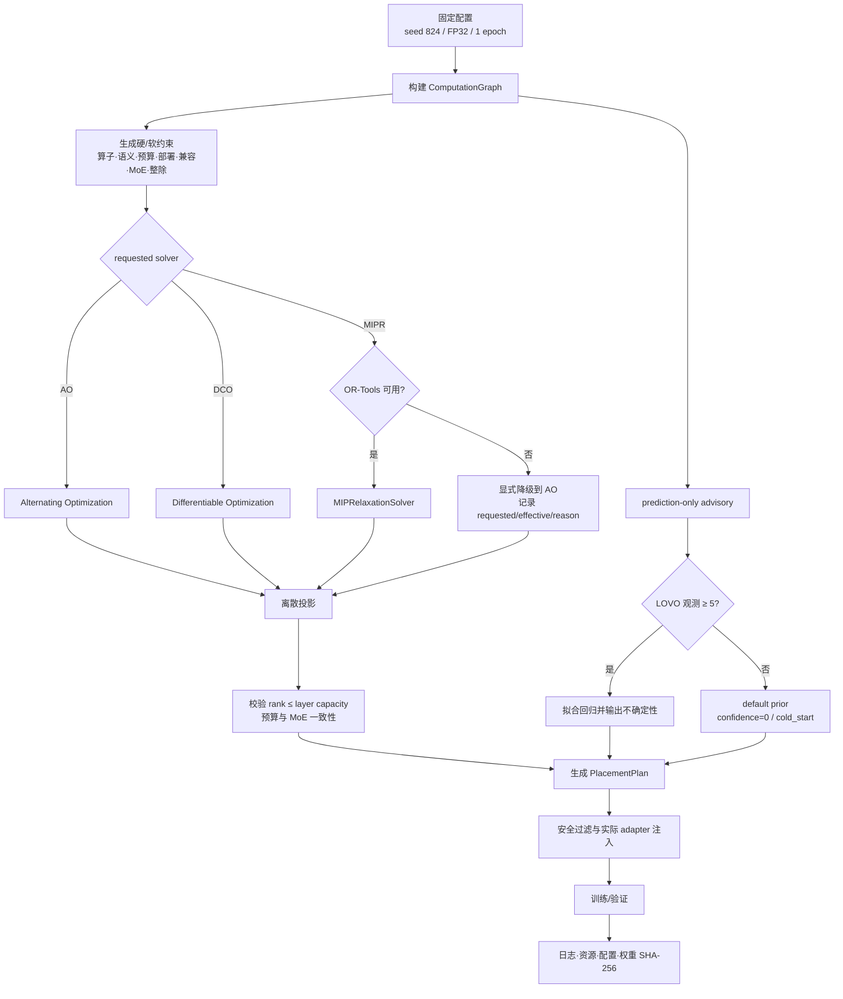

# C3 Planner 流程与 Solver 审计（2026-08-31）

本记录补齐任务书要求的 planner 流程图、至少两种 solver 日志，以及 MIPR 依赖降级证据。所有数值来自服务器仓库的固定 P0 smoke；1 epoch 结果只验证闭环，不用于宣称收敛精度优劣。

## Planner 实际流程



V-PEFT solver 决定 target/rank；回归/LOVO 分支只提供审计预测，不再调用 legacy planner 生成第二套 placement 决策。这样不会让两个 planner 相互覆盖。

## 固定条件对照

| Dataset | Requested → effective | Solver time | Planned params | Targets | Result |
| --- | --- | ---: | ---: | ---: | --- |
| NEU-DET | AO → AO | 2.215 s | 191,616 | 59 | completed |
| DeepPCB | AO → AO | 2.236 s | 191,616 | 59 | completed |
| NEU-DET | DCO → DCO | 31.945 s | 1,352,576 | 59 | completed after bug fix |
| DeepPCB | DCO → DCO | 31.167 s | 1,352,576 | 59 | completed after bug fix |
| NEU-DET | MIPR → AO | 2.092 s | 191,616 | 59 | completed; OR-Tools missing |

DCO 的 solver 时间约为 AO 的 14 倍，规划 adapter 参数约为 AO 的 7.06 倍。因此当前证据不支持把 DCO 设为默认，也不应为了让 V-PEFT“看起来更好”而修改精度数值；P0 默认仍保留 AO。

计划 target 为 59，后续安全过滤后实际注入为 52；两者分别保存在 `placement_plan.targets` 与 `target_audit.selected_count`，不能混写。

## 真实 bug 与复现

首次 DCO 运行在两个数据集上均失败：

```text
ValueError: PlacementPlan rank 64 for '1.conv' exceeds layer capacity 16
```

根因是 hard constraints 未实现 `rank <= min(in_channels, out_channels)`，而最终 `PlacementPlan.validate_model()` 会执行该校验。修复后 DCO 在两个数据集上均 exit 0。与此同时，runner 原先会在训练失败后仍强制导出 adapter，导致缺少 checkpoint 时出现第二个 `FileNotFoundError`；现在失败运行跳过 adapter 导出并保留可用证据。

失败复现日志没有删除：

- `logs/neu_det_vpeft_dco_gpu_fp32_seed824/train.log`
- `logs/deeppcb_vpeft_dco_gpu_fp32_seed824/train.log`

## LOVO / predicted delta 的边界

新运行不再把 `predicted_delta` 留为 `null`。当前输出为：

- predicted ΔmAP: `0.0660295`
- heuristic std error: `0.05`
- 95% interval: `[-0.0319705, 0.1640295]`
- confidence: `0.0`
- evidence state/source: `cold_start / default_prior`
- observations: `0`

这只是可追踪的先验预测，不是测得的 ΔmAP，也不是已拟合的 LOVO 结果。代码明确记录 `uses_learned_evidence=false`。只有收集至少 5 个唯一观测并完成校准后，才能把它表述为 learned LOVO evidence。

## 证据入口

- 结构化汇总：`evidence/solver_audit_20260831.json`
- DCO 成功：`logs/neu_det_vpeft_dco_fixed_gpu_fp32_seed824/`、`logs/deeppcb_vpeft_dco_fixed_gpu_fp32_seed824/`
- MIPR 降级：`logs/neu_det_vpeft_mip_fallback_gpu_fp32_seed824/`
- 历史 AO：`logs/neu_det_vpeft_gpu_fp32_seed824/`、`logs/deeppcb_vpeft_gpu_fp32_seed824/`

结论：solver 审计与降级链路已补齐；LOVO 运行时字段已可审计，但数据驱动校准仍是后续工作，不能标记为完成。
